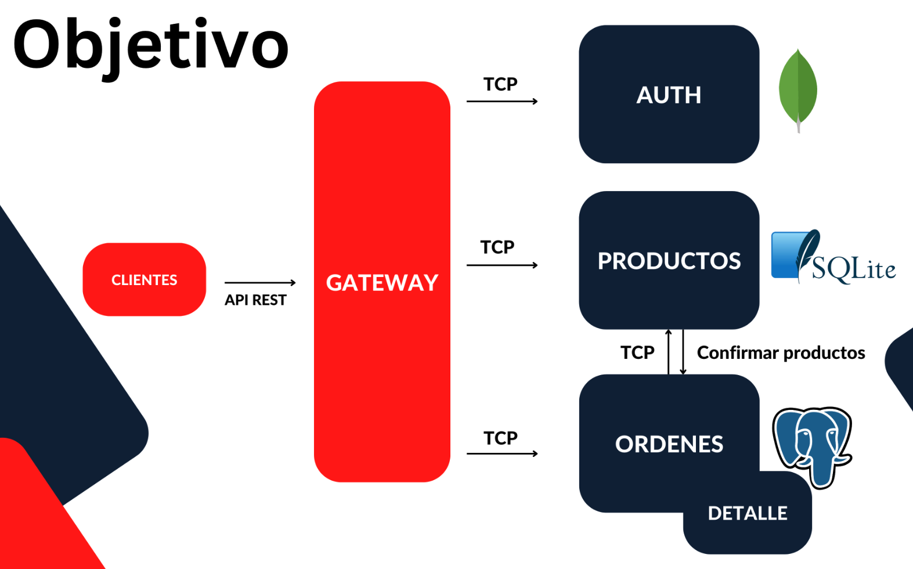

# Products App

En esta carpeta es donde vamos a tener toda nuestra aplicación completa, todos nuestros microservicios y el gateway.

Lo primero es actualizar el `Nest CLI` a la última versión: `npm install -g @nestjs/cli`

El orden de creación de los microservicios es el siguiente:

- products-ms
- client-gateway
- orders-ms

Nuestro objetivo es hacer esto:

Como evolución de nuestro proyecto, el objetivo evoluciona a:

Donde vemos que las órdenes y el detalle van a estar en el mismo microservicio, porque están altamente acoplados entre sí. Una orden no va a existir sin un detalle, y, si una orden cambia, afecta a su detalle.

Además la órdenes van a hablar con el microservicio de productos para validar dichos productos.

NOTA: Este sigue sin ser el esquema final, solo vemos como va evolucionando el proyecto.

## Problemas del Objetivo 2 y posibles soluciones

Todavía no, pero si el proyecto sigue creciendo, llega un punto donde vamos a perder el control de qué llama a qué, o como crecen nuestros microservicios.

El problema es, por ejemplo, si queremos que tras una transacción o un evento, queremos notificar a dos o tres microservicios de manera simultanea. Esto puede acabar siendo un follón.

Una cosa que ayuda muchísimo es utilizar lo que se llama un Service Broker, un middleman que se encarga de procesar todo ese montón de paquetes y pedidos entre microservicios.

Con todo esto, vamos a transformar nuestra estructura actual de microservicios al Objetivo 3.

Vamos a incluir un servidor NATS.

Documentación: https://nats.io/ (Se recomienda ver el video de 8 min. que aparece al final de esa web)

La idea es que todos nuestros servicios hablen/escuchen con el servidor de NATS y estén subscritos a unos mensajes.

El NATS Server se va a encargar de notificar a todos nuestros microservicios a los que les interese un mensaje concreto. Por ejemplo, yo puedo tener el mensaje `creación de una orden`. Más de un microservicio puede estar escuchando la creación de una orden y reaccionar basado en el. Esto ayuda a eliminar comunicaciones y conexiones directas entre microservicios, aunque se puede mantener una comunicación con NATS y a la vez una comunicación uno a uno entre microservicios (con TCP o lo que sea), no es excluyente.

El uso de NATS Server hace más sencillo de programar y de mantener, incluido la gestión de errores, nuestros microservicios.

## Testing

En cada proyecto aparece un apartado de testing, pero si es importante tener siempre levantado, como mínimo, el proyecto `client-gateway`, que es el que se comunica con los microservicios, y al menos un microservicio, para poder probar algo.

Llegado al objetivo 2, ya es obligatorio levantar todo:

- Levantar de manera independiente el proyecto client-gateway usando Peacock para diferenciar el espacio de trabajo: `npm run start:dev`
- Levantar de manera independiente el proyecto products-ms usando también Peacock para diferenciar el espacio de trabajo: `npm run start:dev`
- Levantar de manera independiente el proyecto orders-ms usando también Peacock para diferenciar el espacio de trabajo: `npm run start:dev`
