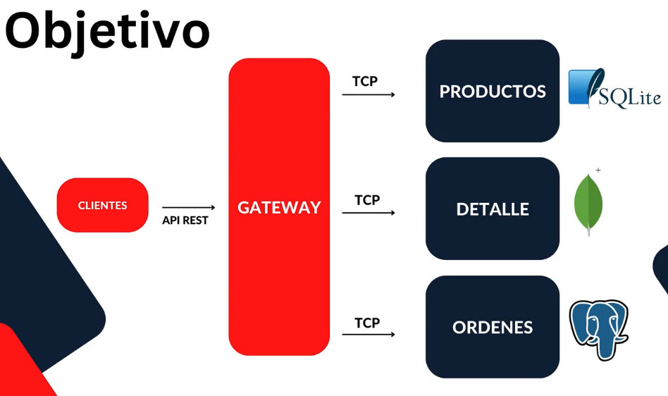

# Products App

En esta carpeta es donde vamos a tener toda nuestra aplicación completa, todos nuestros microservicios y el gateway.

Lo primero es actualizar el `Nest CLI` a la última versión: `npm install -g @nestjs/cli`

El orden de creación de los microservicios es el siguiente:

- products-ms
- client-gateway
- orders-ms

Nuestro objetivo es hacer esto:

## Testing

En cada proyecto aparece un apartado de testing, pero si es importante tener siempre levantado, como mínimo, el proyecto `client-gateway`, que es el que se comunica con los microservicios, y al menos un microservicio, para poder probar algo.
