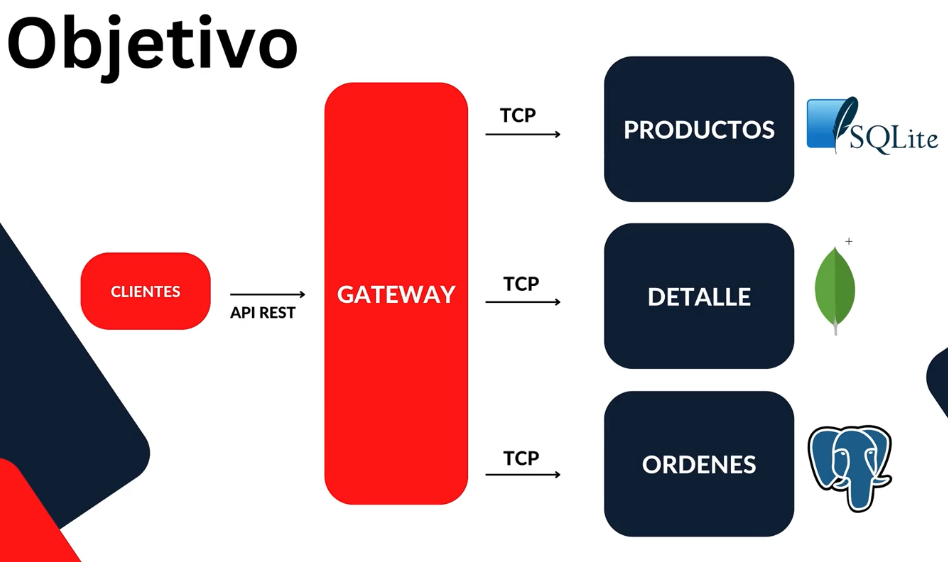

# products-ms

En esta sección crearemos nuestro primer microservicio para manejar productos, pero nacerá como un servicio REST que luego transformaremos en un microservicio para que mentalmente podamos hacer las conexiones de las similitudes.

Puntualmente veremos:

- CRUD
- MessagePattern
- SQLite
- Prisma con Nest
- Migraciones
- Transformar REST a Microservicio
- Aplicaciones Híbridas Rest + Microservicios (esto se verá a profundidad en la sección de Auth)
- GitHub - Organizaciones

Una vez creado nuestro microservicio de productos, empezaremos a construir las otras piezas de este rompecabezas poco a poco.

## Creación de proyecto

En la carpeta `03-Products-App` se ha creado el microservicio, que, como se ha dicho, nace como un servicio REST, de la siguiente forma:

```
nest new products-ms
```

## Ejecución del proyecto

```
npm run start:dev
```

## Creación del RESTFul API endpoint

Lo hacemos como lo haríamos usualmente, es decir, con un `resource`.

```
nest g res products --no-spec
```

Seleccionamos `REST API` y a la pregunta sobre generar un CRUD respondemos con `Y`.

## Archivo .eslintrc.js

Se añade el siguiente código en el objeto `rules` del fuente `.eslintrc.js`

```
    'prettier/prettier': [
      'error',
      {
        endOfLine: 'auto',
      },
    ],
```

## Validaciones

Instalamos Los siguientes paquetes para poder hacer uso de las validaciones:

```
npm i class-validator class-transformer
```

No olvidar añadir la configuración global de pipes para que las validaciones surtan efecto, esto en el fuente `main.ts`.

```
app.useGlobalPipes(
  new ValidationPipe({
    whitelist: true,
    forbidNonWhitelisted: true,

    // Esto es un extra
    // En el formato de respuesta de los errores en NestJS estos vendrán agrupados por la key del body.
    exceptionFactory: (errors) => {
      const result = errors.map((error) => ({
        [error.property]: {
          errors: Object.values(error.constraints),
        },
      }));

      return new BadRequestException(result);
    },

  })
);
```

## Configurar variables de entorno

Vamos a poner como variable de entorno:

- Puerto: porque cuando transformemos a un microservicio, tenemos que definir en qué puerto y host va a estar corriendo

Estas variables de entorno siempre las vamos a necesitar.

En la carpeta `src` creamos la carpeta `config` y dentro creamos los archivos `envs.ts` y `index.ts`.

También, en el root de la aplicación creamos el archivo `.env` y su copia `.env.template` que es la que llevamos a git.

Instalamos los siguientes paquetes:

```
npm i dotenv joi
```

Siendo `joi` el validador del esquema

## Prisma - SQLite

Documentación: https://docs.nestjs.com/recipes/prisma

Otra documentación para aplicar patrón repository:

- https://www.linkedin.com/pulse/implementing-repository-pattern-nestjs-nadeera-sampath/
- https://www.tomray.dev/nestjs-prisma

Prisma es similar a TypeORM y a Sequelize.

Tenemos que instalar los siguientes paquetes:

```
npm i -D prisma
```

Lo que hace Prisma es crearnos un cliente, y nosotros trabajamos con ese cliente. El cliente está personalizado a nuestra base de datos.

Una vez instalado, ejecutamos para ejecutar la inicialización:

```
npx prisma init
```

Esta ejecución modifica nuestro fuente `.env`, donde añade una cadena de conexión para PostgreSQL. Como nosotros vamos a trabajar con SQLite tenemos que cambiarlo a:

```
DATABASE_URL="file:./dev.db"
```

SQLite es una BBDD que crea un archivo físico.

La inicialización también creó un directorio `prisma` y un archivo `schema.prisma`.

En dicho archivo, cambiamos el provider del datasource a `sqlite`.

Y nos creamos, también en dicho archivo, el modelo de nuestra tabla `Product`.

Ahora ejecutamos la migración. Lo que hace es preparar nuestra BBDD para que luzca exactamente como tenemos definido el esquema.

```
npx prisma migrate dev --name init
```

Esto crea en la carpeta `prisma` la carpeta `migrations`, también la BD `dev.db` y un journal `dev.db-journal`.

Por último, hacemos la instalación del Prisma client.

```
npm i @prisma/client
```

Este Prisma client es creado basado en nuestro esquema y también se va a relacionar con nuestros servicios. De ahí que ahora tocamos el fuente `src/products/products.service.ts`.

En la otra documentación se habla de como trabajar con el patrón repository en vez de con el service.

## Obtener productos y paginarlos

Vamos a permitir que el usuario pase como query parameters, opcionales, la página que queremos `page` y el número de elementos por página `limit`.

Tenemos que validar que se envían números y dentro de un rango.

Ejemplo de url: `http://localhost:3001/products?page=1&limit=10`

Creamos un `dto` de paginación.

En la carpeta `src` creamos un directorio `common` donde vamos a poner objetos que no estén relacionados con nuestro módulo principal products.

Dentro creamos la carpeta `dto` y dentro el archivo `pagination.dto.ts`.

Dentro de `common` creamos también un archivo `index.ts`.

## Actualizar productos

Gracias a que usamos el Nest CLI con resource, ya tenemos creado el archivo dto para la actualización, `update-product.dto.ts`.

## Eliminar productos de forma física y suave

Especialmente en microservicios NO se recomienda hacer borrados físicos porque pueden crear problemas de integridad referencial. Lo suyo es hacer eliminaciones suaves, con banderas que indican que el registro está eliminado.

En este ejemplo se van a hacer deletes de la dos formas, físicos y suaves.

Para la eliminación suave creamos en el esquema de Prima `Product` una nueva columna (bandera) que indica si el registro está o no disponible.

Tenemos que volver a hacer la migración:

```
npx prisma migrate dev --name available
```

Esta bandera la vamos a indexar nuestras querys se ejecuten más rápido. Esta creación de indexación se hace también en `schema.prisma`, y una vez hecho, tenemos que volver a realizar la migración:

```
npx prisma migrate dev --name available-index
```

También tenemos que modificar el service para que tenga en cuenta el nuevo campo available y obtener solo los disponibles.

## Transformar a microservicio

Técnicamente hablando, lo que tenemos hasta ahora puede ser considerado como un microservicio que se comunica por peticiones REST o HTTP, pero esto sería el último modelo del modelo OSI y no queremos eso.

Lo que queremos es transportar nuestra información mediante TCP.

Documentación: https://docs.nestjs.com/microservices/basics

Realizamos la instalación del siguiente paquete:

```
npm i --save @nestjs/microservices
```

También vemos en la documentación que en el fichero `main.ts`, en vez de hacer la creación tradicional, se usa `createMicroservice` donde se especifica el tipo de transporte que queremos.

También se podría mantener un híbrido, dejando en `main.ts` nuestra creación `create` y añadir en otra línea la sentencia `app.startAllMicroservices()`, pero no queremos que sea un híbrido. También vamos a hacer un híbrido cuando trabajemos con la autenticación, ya que esta puede ser una API propia y a la vez un microservicio.

Vamos a trabajar de dos maneras (dos patrones) a lo largo de este curso:

- Emisión de eventos: el @EventPattern manda el evento al interesado pero no espera nada. Útil por ejemplo para grabar logs
- Mensajería: por defecto, la mensajería mediante @MessagePattern es similar a la comunicación con RESTFul tradicional. Se envía una petición y esperamos a la respuesta para poder seguir trabajando

Vamos a trabajar con los dos tipos de patrones, pero vamos a empezar con la mensajería.

## Message Pattern

Si tenemos este @MessagePattern en un microservicio A

```
@MessagePattern({ cmd: 'sum' })
```

Un microservicio B que quiera comunicarse con el microservicio A va a tener que poner exactamente lo definido en ese @MessagePattern, es decir `{cmd: 'sum'}`, siendo este el nombre del mensaje. El nombre del mensaje no necesariamente tiene que ser un objeto, también puede ser un string.

Hay una buena práctica que podemos usar para dar nombre a los mensajes. Consiste en usar enum. Mejora la legibilidad del código y reduce la probabilidad de errores tipográficos, facilitando además el mantenimiento y la actualización de los valores.

En la carpeta `common` creamos la carpeta `constants` y dentro el fuente `message_pattern.constants.ts`.

## Testing

En la carpeta `scripts` hay un archivo `products.sql` con 50 productos para insertar en la BD. Yo estoy usando la extensión `SQLite` de VSCode para trabajar con BBDD SQLite.

Postman: En la carpeta del root `postman` dejo los ejemplos de rutas a ejecutar para hacer POST, GET, PATCH y DELETE. Al hacer la transformación a microservicio NO funcionan. Queda para commits anteriores.

Una vez hemos transformado este proyecto a microservicio, la forma de probar esto es a través de un Gateway, que es un punto intermedio en el cual vamos a crearnos un RESTFul API endpoint al que se van a conectar nuestros clientes. Este Gateway se va a comunicar con los microservicios usando TCP.


