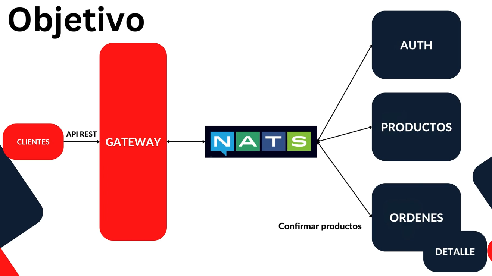
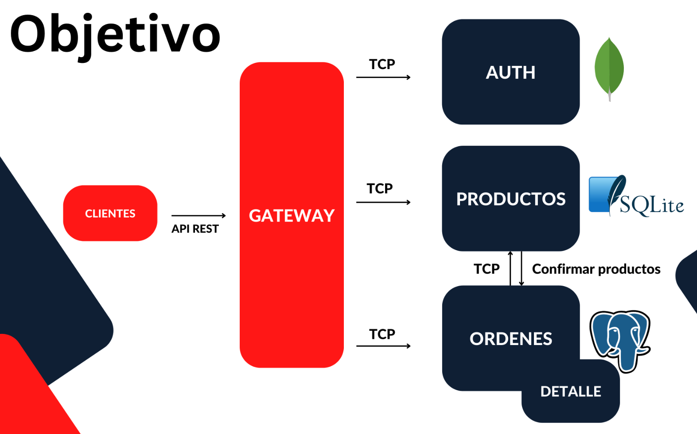

# Products App Nats

En esta carpeta es donde vamos a tener toda nuestra aplicación completa, todos nuestros microservicios y el gateway.

Lo primero es actualizar el `Nest CLI` a la última versión: `npm install -g @nestjs/cli`

El orden de creación de los microservicios es el siguiente:

- products-ms
- client-gateway
- orders-ms

Nuestro objetivo es hacer esto:



Vamos a incluir un servidor NATS.

Documentación: https://nats.io/ (Se recomienda ver el video de 8 min. que aparece al final de esa web)

La idea es que todos nuestros servicios hablen/escuchen con el servidor de NATS y estén subscritos a unos mensajes. Por tanto vamos a dejar de usar TCP y vamos a incluir un servidor de NATS que se va a encargar de la mensajería (lo que llamamos un service broker) con el resto de los microservicios.

El NATS Server se va a encargar de notificar a todos nuestros microservicios a los que les interese un mensaje concreto. Por ejemplo, yo puedo tener el mensaje `creación de una orden`. Más de un microservicio puede estar escuchando la creación de una orden y reaccionar basado en el. Esto ayuda a eliminar comunicaciones y conexiones directas entre microservicios, aunque se puede mantener una comunicación con NATS y a la vez una comunicación uno a uno entre microservicios (con TCP o lo que sea), no es excluyente.

El uso de NATS Server hace más sencillo de programar y de mantener, incluido la gestión de errores, nuestros microservicios.

En concreto, los beneficios de implementar un NATS son:

- NATS tiene un balanceador de carga bastante bueno
- Forma de notificación mediante suscripciones a todos los interesados

## Temas puntuales de la sección

El objetivo de la sección es comunicar nuestros microservicios a través de NATS en lugar de TCP.

La ventaja de trabajar con Nest, es que realmente no tenemos que hacer mayor cambio en nuestros microservicios para que se comuniquen por otro canal de transporte, pero si necesitamos configurar un servidor NATS para que sea quien maneje nuestra mensajería.

## Introducción a Nats - Problema / Solución

Recordar que venimos de esto (ver proyecto `03-Products-App`):



El problema es que ya tenemos mucho código entre la configuración TCP con nuestro Gateway y el microservice de Órdenes más la configuración TCP con nuestro microservice Órdenes y el microservice Productos.

Vemos que nos va a hacer falta configurar otro TCP con nuestro microservice Órdenes y el microservice Auth... Esto se está volviendo inmanejable.

De esto pasamos a nuestro objetivo actual, es decir:


La idea es que las comunicaciones fluyan a través de lo que llamamos un Service Broker, en este caso NATS. Todos nuestros microservicios se conectarán a nuestro servidor NATS y este se encarga de decirle a los microservicios que, desde el Gateway, ha llegado una solicitud, por ejemplo, para la creación de una orden.

El microservicio Órdenes está suscrito a escuchar la petición de creación de una orden, y por ese mismo canal de comunicación se va a tener la respuesta. Sabemos que la Órdenes necesitan que exista el id de Producto. Por ese mismo canal vamos a llegar a nuestro servidor de NATS, y este va a irse a hablar con el microservicio de Productos, sirviendo de intermediario entre los dos microservicios.

Ver [Presentación PDF](../Documentacion/microservicios.pdf) desde la página 50 a la 55 para ver la presentación PDF de NATS.

## Continuación de la aplicación

Recordar que queremos pasar de una estructura con comunicación por TCP a una comunicación mediante NATS.

## Levantar servidor de NATS

Documentación:

- https://nats.io/
  - Ver el video de 8 minutos: https://www.youtube.com/watch?v=hjXIUPZ7ArM&t=9s
- https://hub.docker.com/_/nats

Para evitar instalar NATS de forma física en el equipo, vamos a usar la imagen oficinal de NATS de DockerHub (segundo enlace de la documentación)

Primero lo vamos a echar a andar de forma rápida y luego lo haremos con Docker Compose, en nuestra futura red de Docker, para no tener que memorizar el comando.

En la Raspberry Pi ejecuto:

```
docker run -d --name nats-server -p 4222:4222 -p 8222:8222 nats
```

Este comando aparece en DockerHub y, sobre los puertos, explica:

```
# Each server exposes multiple ports
# 4222 is for clients.
# 8222 is an HTTP management port for information reporting.
# 6222 is a routing port for clustering (No lo usamos)
```

Para probar, acceder con el navegador a la ruta: `http://192.168.1.41:8222/`

Pulsamos en Connections, pero no veremos ninguna conexión. Conforme nuestros microservicios y el gateway se vayan conectando, irán apareciendo.

## Testing

En cada proyecto aparece un apartado de testing, pero si es importante tener siempre levantado, como mínimo, el proyecto `client-gateway`, que es el que se comunica con los microservicios, y al menos un microservicio, para poder probar algo.

Llegado al objetivo 2, ya es obligatorio levantar todo:

- Levantar de manera independiente el proyecto client-gateway usando Peacock para diferenciar el espacio de trabajo: `npm run start:dev`
- Levantar de manera independiente el proyecto products-ms usando también Peacock para diferenciar el espacio de trabajo: `npm run start:dev`
- Levantar de manera independiente el proyecto orders-ms usando también Peacock para diferenciar el espacio de trabajo: `npm run start:dev`
  - Levantar la base de datos en Raspberry Pi
    - Ir a la ruta `/home/pi/docker/postgresql/orders-ms` y ejecutar `docker compose up -d`

Nats: `docker run -d --name nats-server -p 4222:4222 -p 8222:8222 nats`
