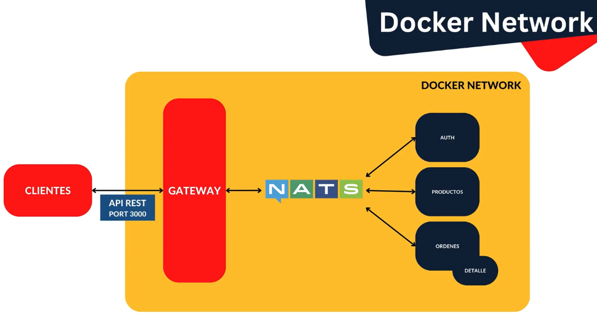

# 05-Products-App-Nats-Docker

Nos vamos a enfocar en como poder trabajar todos nuestros microservicios y poder seguir desarrollando nuevas características (o features) de una manera que nos permita tener una única terminal corriendo, y también tener un repositorio que tenga todas las referencias a los proyectos. Esto no significa crear un monorepo, sino que serán links que nos llevarán al repositorio donde está el fuente de esa aplicación. También vamos a crear un archivo de Docker Compose para que, mediante un único comando, levante todo, es decir, la BD, el servidor de NATS, el Gateway y nuestros microservicios.

En esta sección no nos vamos a enfocar mucho en la parte de microservicios, pero si en como manejarlos. Es una forma organizada de trabajar con microservicios.

Por tanto, vamos a tomar todo el código y nos vamos a crear un nuevo repositorio que nos permita, mediante un único comando, clonar todo el proyecto, con un segundo comando, actualizar los repositorios, y con un tercer comando, levantar todo automáticamente.

Recordar que el problema que queremos resolver es:

## Testing

Para levantar de forma manual:

- Levantar el servidor de NATS: `docker run -d --name nats-server -p 4222:4222 -p 8222:8222 nats`
- Levantar de manera independiente el proyecto client-gateway usando Peacock para diferenciar el espacio de trabajo: `npm run start:dev`
- Levantar de manera independiente el proyecto products-ms usando también Peacock para diferenciar el espacio de trabajo: `npm run start:dev`
- Levantar de manera independiente el proyecto orders-ms usando también Peacock para diferenciar el espacio de trabajo: `npm run start:dev`
  - Levantar la base de datos en Raspberry Pi
    - Ir a la ruta `/home/pi/docker/postgresql/orders-ms` y ejecutar `docker compose up -d`
