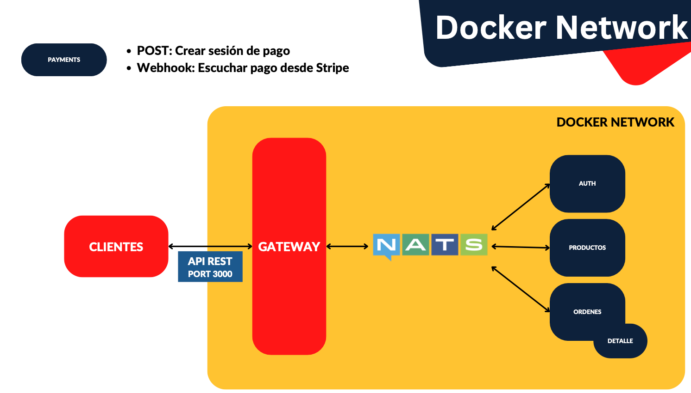
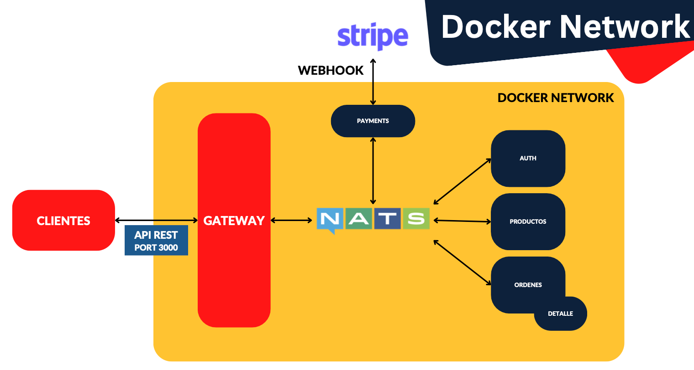
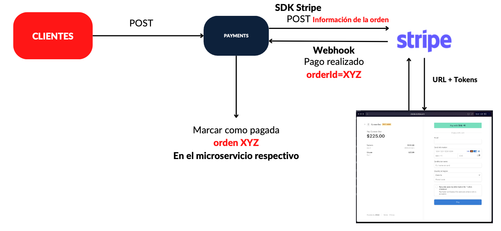

# Stripe

En esta sección trabajaremos con dos puntos importantes:

- Crear el RESTful Api para crear sesiones de pago
- Crear un webhook que permita a Stripe avisarnos cuando es realizado un pago

La sección es muy importante para comprender el funcionamiento de los pagos a través de servicios de tercero que notifican mediante webhooks cuando un pago es realizado.

Recuerden que eventualmente transformaremos este API en una aplicación híbrida REST con protocolo Nats de comunicación, debido a que el webhook necesita comunicación con el mundo exterior y a la vez hablar por Nats hacia los interesados del pago.

## Explicación del objetivo de la sección

Este es el objetivo que queremos conseguir.

Payments va a nacer completamente desligado de la red de microservicios, con el objetivo de empezarlo a desarrollar.

Cuando tengamos la funcionalidad básica, indicada en la imagen de arriba, lo vamos a integrar a nuestra red de microservicios, quedando así.

Vemos que tanto Nats como Stripe, a través de Webhook, se va a comunicar con el módulo de Payments.

Un webhook se puede explicar diciendo que es un endpoint que otra entidad va a terminar llamando (Post) de manera automática.

En este diagrama puede verse como va a funcionar.

Nuestros clientes (Postman en mi caso) va a hacer una petición POST directamente a nuestro endpoint de Payments (temporalmente, antes de hacer la integración con nuestra red de microservicios) Vamos a usar el SDK propio de Stripe, que no deja de ser una petición POST que le llega a Stripe con la información de la orden.

Stripe va a crear la pantalla. Esta pantalla está dentro de los servidores de Stripe y es donde el cliente hace el pago. Nosotros también mandamos un URL de retorno, para que, cuando la persona pague o eche para atrás, pueda volver de nuevo a nuestra aplicación.

Cuando la persona pague, nosotros esperamos que el mismo Stripe dispare nuestro Webhook, es decir un POST en nuestro microservicio Payments que incluye la orden que se pagó.

Nosotros, desde nuestro microservicio Payments, llamamos al microservicio de las órdenes para indicar que la orden fue pagada. Esta última parte la haremos después.

## Payments Microservice

En este proyecto que ya contiene todos los microservicios, Nats y Docker, vamos a crear el microservicio de Payments.
