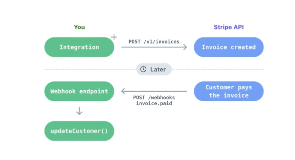

# Payments Microservice

En este proyecto que ya contiene todos los microservicios, Nats y Docker, vamos a crear el microservicio de Payments.

Para crear el proyecto, que todavía no es un microservicio, sino un proyecto RESTFul tradicional:

- `nest new payments-ms` y seleccionamos npm
- Hacemos la configuración de las variables de entorno
  - Dentro de `src` creamos la carpeta `config` y dentro el archivo `envs.ts` y el archivo de barril `index.ts`
  - Uso el snippet que me creé `microenvs`
  - Instalamos los paquetes: `npm i dotenv joi`
- Hacemos uso del archivo de variable de entorno en `main.ts`
- Creamos en la raiz los archivos `.env` y `.env.template`
- Añadimos al fichero `.gitignore` el texto `.env` para que no lo pase a GitHub

## Creación de RESTFul API Endpoints

En la terminal ejecutamos: `nest g res payments --no-spec`

Seleccionamos `REST API` y a la pregunta sobre si crea los CRUD entry points seleccinamos `n`. Esto crea los fuentes:

- payments.controller.ts
- payments.module.ts
- payments.service.ts

En `payments.controller.ts` nos definimos los endpoints.

## Configuración de Stripe

https://stripe.com/es

La idea es configurar y obtener nuestro Stripe Secret Key.

- Entramos en nuestra cuenta de Stripe
- Pulsamos en el botón `Desarrolladores`
- Pulsamos la tab `Claves de API`
- Cogemos la `clave de prueba` con la que vamos a identificar a mi backend
- Creo una nueva variable de entorno en mi fichero `.env` y `.env.template` e indico la API KEY
- En la página principal, pulsamos en el botón `Empezar a usar los pagos`, nos vamos a la tab `Herramientas para desarrolladores` y pulsamos en el cuadro `SDK y componentes de interfaz de usuario`
  - https://docs.stripe.com/libraries
  - Ahí tenemos el paquete que tenemos que instalar `npm install stripe` Lo instalamos
- La documentación de la API de Stripe está en el icono de interrogación, arriba en la parte derecha (Developer docs)
  - Ver, por ejemplo: https://docs.stripe.com/terminal/references/api/js-sdk

Vamos a nuestra configuración `src/config/envs.ts` y añadimos nuestra nueva variable de entorno `STRIPE_SECRET`.

Luego nos vamos al service `src/payments/payments.service.ts` y hacemos la configuración usando el SDK de Stripe.

## Crear sesión de pago

Desde nuestro controlador `src/payments/payments.controller.ts` método `createPaymentSession()` vamos a llamar a nuestro service con un método nuevo `createPaymentSession()`.

Para probar, desde Postman ejecutamos el endpoint `Create Payment Session`.

Al final de la respuesta veremos una url. Pulsamos `Cmd` y con el ratón hacemos click a esa URL. Se abrirá este tipo de ventana:

Yo he informado esos valores, pero cualquiera vale. Pulsamos `Pagar`.

Veremos que redirecciona a la ruta `http://localhost:3003/payments/success`, indicada en `payments.service.ts`.

Si ahora vuelvo al Dashboard de Stripe y pulso en Saldos y luego en Toda la actividad, veo:

Y ya hemos hecho el cobro a esa persona con esa tarjeta de crédito.

Recordar que todo esto es `FICTICIO`.

## Payment Session DTO

Vamos a modificar `payments.service.ts` para no usar hardcode. La información va a estar basada en la que venga desde otro microservicio.

En la carpeta `src/payments` creamos la carpeta `dto` y dentro el dto `payment-session.dto.ts`.

Instalamos los paquetes: `npm i class-validator class-transformer`

Hacemos la configuración de los global pipes en nuestro fichero `main.ts` y modificamos nuestro controller y nuestro service para recibir y trabajar con el dto.

Para probar, desde Postman ejecutamos el endpoint `Create Payment Session`.

## Probando Webhooks de Stripe

Esta parte es para que nos notifique Stripe de que hemos realizado el pago. No podemos fiarnos de la `success_url` o `cancel_url` que aparecen en `payments.service.ts` porque puede que el usuario pagara y cerrara el navegador web, por lo que nunca accederíamos a esos URLs.

Vamos a usar Webhooks para enterarnos de que el usuario ha pagado.

Vemos que es el mismo Stripe quien, mediante un POST, llama a nuestro Webhook, donde ya indicamos que se ha pagado algo. Es en nuestro Webhook donde hacemos la verificación de que proviene de Stripe, con su firma, y sí nosotros actualizamos la orden.

En esta clase solo vamos a probar el endpoint que tenemos creado, `payments.controller.ts`, método `stripeWebhook()`.

Para probar esto, en `Stripe`, en el `Dashboard` pulsamos en el botón `Desarrolladores` y luego `Webhooks`.

Hay muchos webhooks en Stripe. Podemos saber cuando se crea un producto, cuando se borra, cuando se crea un intento de pago, cuando falla, cuando sale bien...

Pulsamos en `Añadir un punto de conexión`. Hay dos formas, con el CLI `Probar en un entorno local`, o, de nuevo pulsando `Añadir un punto de conexión`.

Ver este video `https://cursos.devtalles.com/courses/take/nestjs-microservicios/lessons/53497338-probando-webhooks-de-stripe` para hacerlo con el CLI. Yo prefiero no instalar nada más en mi ordenador y por eso no lo voy a hacer con el CLI.

Tenemos que modificar `main.ts`, `payments.controller.ts` y `payments.service.ts`.

## Testing

- Ejecutar con el comando: `npm run start:dev`
- En la carpeta `postman` se ha dejado un ejemplo de llamada desde Postman
