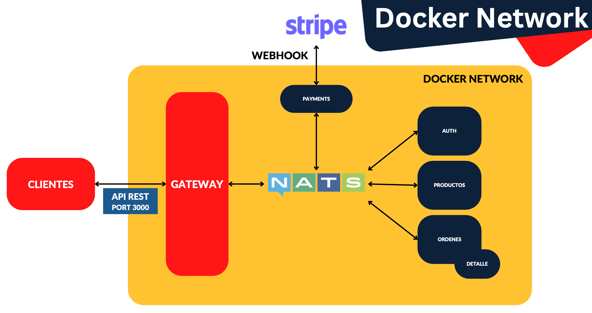
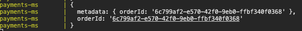

# Integraciones con microservicios - EventPattern

Vamos a integrar payments-ms a nuestra red de microservicios para que tenga la comunicación con Nats.

Lo que queremos hacer es, cuando desde el client-gateway entre la creación de una orden, ese microservicio order-ms va a hablar con payments-ms. Este creará la sesión a Stripe que nos acabará devolviendo una URL y que volverá a nuestro microservicio orders-ms, y de ahí al usuario que mandó llamar la creación de una orden de pago.

Ese usuario irá entonces a pagar a Stripe. Una vez paga responderemos al usuario. Será nuestro Webhook que va a esperar la comunicación de Stripe y el Webhook hablará entonces con nuestro orders-ms para que este marque la orden como pagada.

Vamos a aprovechar para ver la otra forma de comunicarnos con microservicios.

Hasta ahora hemos visto el `MessagePattern`, que es que emitimos una solicitud y esperamos una respuesta.

Ahora vamos a usar `EventPattern` que consiste en preguntar, pero no esperamos ninguna respuesta, sino que seguimos con lo que estemos haciendo.

Con BBDD vamos a hacer dos cosas:

- Vamos a modificar dos columnas en nuestra tabla de órdenes
- Vamos a crear una nueva tabla para hacer una relación uno a uno para aprender a hacerlas en Prisma, donde vamos a guardar los recibos de nuestros pagos. Evitaremos null en fecha de pago, ya que solo habrá un registro si se paga la orden

Objetivo:



Por tanto, en esta sección trabajaremos conectando el Payments Microservice con nuestros otros microservicios.

Puntualmente veremos:

- EventPattern
- Payments hacia Orders
  - Webhook
- DeckHook
- Modificaciones a la estructura de la base de datos

## Agregar repositorio al Products Launcher

Recordar que siempre que hablemos de Products Launcher, estamos hablando sobre todo del repositorio en Bitbucket: `https://bitbucket.org/neimerc/products-launcher/src/main/`

Vamos a unir el repositorio de payments-ms con nuestro products-launcher.

## Microservicio Híbrido - REST - Nats

Queremos que nuestro `payments-ms` sea híbrido.

Por ahora, `payments-ms` está dentro de nuestra red.

Lo vamos a comunicar con NATS para que pueda hablar con los demás microservicios (es la única forma de llegar a ellos)

Nosotros tenemos también que habilitar un puerto, el de nuestra aplicación REST, para que Stripe, mediante el Webhook, hable con `payments-ms`. Esto se puede hacer de varias maneras:

- No híbrido: En este caso Stripe se conecta por nuestro gateway, o podríamos crear otro gateway nuevo. No lo vamos a hacer así porque no queremos que se sepa todo lo que está expuesto en el gateway. Queremos que sea medio anónimo, aunque eso no es una medida de seguridad per se. Recordar que como medidas de seguridad con Stripe tenemos una verificación de la firma (stripe-signature), tenemos un endpointSecret y nuestra variable de entorno stripeSecret
- Híbrido: va a soportar tanto NATS como HTTP

De nuevo, en Bitbucket (https://bitbucket.org/neimerc/products-launcher/src/main/), trabajando con los submodulos, tenemos que entrar en `payments-ms` y ejecutar `npm i` para instalar las dependencias.

Ahora instalamos dos paquetes dentro de la carpeta de `payments-ms`. Vamos a la documentación de Nest (https://docs.nestjs.com/microservices/basics#installation) e instalamos

```
npm i --save @nestjs/microservices
```

Y también instalamos NATS (https://docs.nestjs.com/microservices/nats)

```
npm i --save nats
```

Ahora modificamos nuestro `main.ts` para levantar la parte de los microservicios. También modificamos nuestro fichero `.env` y `.env.template`, y también `config/envs.ts`.

Volvemos a bajar y a levantar nuestro `docker-compose` y, para saber que es correcto, me voy a Portainer, a los containers, y pulso click sobre el puerto 8222 de NATS. Se abre la web y cambio al URL a `http://192.168.1.41:8222/connz`. Debo ver tres conexiones.

Ahora tenemos que modificar `payments.controller.ts` para que podamos recibir el payload y no el body. Esto lo podemos manejar de las dos formas, con un POST o con un MessagePattern.

## PaymentSession desde Order MS

Vamos a seguir con lo que indicamos en la sección anterior.

Vamos a trabajar con POST y con MessagePattern. Para ello modificamos `payments.controller.ts`.

Vamos a llamar a nuestro microservicio `payments-ms` desde el microservicio `orders-ms`, en `orders.controller.ts`. También creamos una nueva interface. En `/dto` creamos la carpeta `interfaces` y dentro la interface `order-with-products.interface.ts` que muestra como luce nuestra orden con los productos. También tocamos `orders.service.ts`.

Para probar esto, ejecutar en Postman `Create Order`.

## Retornar URLs de sesión

La información que estamos retornando desde `orders.service.ts` no es real. Tenemos que obtener la información basada en la orden.

Con esto llegamos desde nuestro orders-ms hasta nuestro payments-ms.

Modificamos `orders.service.ts`, `payments.controller.ts` y `payments.service.ts`.

Para probar esto, ejecutar en Postman `Create Order`.

Ya tenemos la primera fase de comunicación entre microservicios.

Ahora queda disparar el pago en Stripe, y una vez hecho el pago, tenemos que implementar la comunicación en nuestro Webhook, ya que es este el que se comunica con payments-ms, habla con NATS y dice que alguien pagó la orden, donde querré saber cierta información del recibo, con qué se pagó, cuál es el id del charge de Stripe para mantener la relación...

## Hookdeck - Levantar proxy y forwarder

Nos centramos en la parte de Webhook.

Ahora mismo el Webhook no está escuchando nada.

Levantamos nuestro forwarder (hookdeck): `hookdeck listen 192.168.1.41:3003 stripe-to-localhost` y lo dejamos corriendo para todos los siguientes puntos que quedan de este módulo.

En Postman lanzamos `Create Order` y debemos ver en la consola, tras pagar, la `metadata` y el `orderId`.



**Pregunta**

Tengo una ligera confusión a la hora de usar HookDeck es totalmente necesario?

Quiero decir, ¿no es posible que Stripe me devuelva las respuestas correspondientes directo a mi backend a algun microservicio que lo capture?

Pregunto porque en base al video anterior en que generamos la orden de pago y la hicimos, todo "PARECIÓ" funcionar bien, y en este resulta que hookdeck siempre estuvo off, entonces ahí es un poquito raro de entender si hookdeck es necesario o no..

**Respuesta**

No, no lo es en lo absoluto.

HookDeck es un servicio que nos permite tener un URL publicado en la web (por decirlo así) en el que Stripe llamará, luego, HookDeck nos envía lo que recibió de Stripe a nuestro localhost.

Eso es lo importante aquí, cuando estamos desarrollando el comportamiento del microservicio que recibe los pagos, ocupamos estar probando el código constantemente y ahí es cuando lo necesitamos.

Cuando terminamos todo y lo desplegamos a la web, ya no lo necesitaremos porque Stripe hablará directamente a nuestro "ingress" o puerta que abriremos para que nos comunique los pagos.

De nuevo, sólo es para poder conectar Stripe con nuestro localhost, pero hay otros servicios como NgRok, smee, Microsoft tunnelings (que son los que conozco)

### Testing

- Para ello agregaremos un nuevo submódulo (leer el README.md del proyecto 06-Products-Launcher para saber como hacerlo)
  - En concreto hemos ejecutado: `git submodule add https://bitbucket.org/neimerc/payments-ms.git payments-ms`
- Modificamos `docker-compose.yml` para incluir el nuevo servicio para que se levante
- Copiamos de uno de los submodulos ya existentes los ficheros `.dockerignore` y `dockerfile` y los pegamos en `payments-ms`. Del nuevo fichero `dockerfile` cambiamos el puerto que exponemos al 3003 (aunque esto da igual)
- Definimos las variables de entorno nuevas en el fichero `.env` y `.env.template` y las definimos en `docker-compose.yml`
- Podemos ya ejecutar el comando `docker compose up --build` en la carpeta de `products-launcher`
  - Recordar que yo tengo docker context apuntando a mi Raspberry Pi
- Ya podemos probar en Postman el endpoint de los payments
  - Recordar que mi endpoint será algo así: `http://192.168.1.41:3003//payments/create-payment-session`
- Ir a mi RaspberryPi, a Portainer, y ver si está todo arriba. Si vemos que orders-ms no se arranca, arrancarlo manualmente
