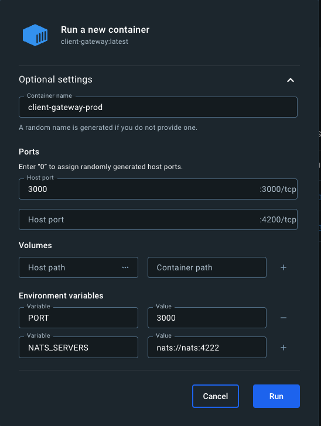
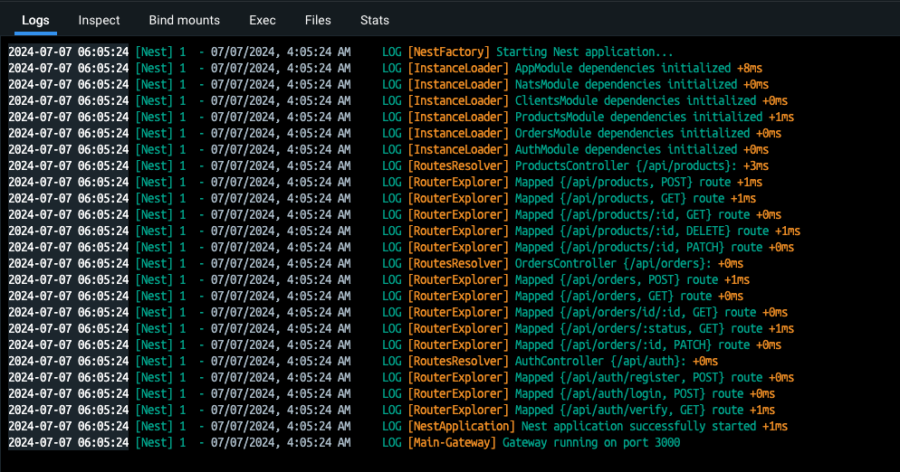

# Containerization - Construcción de imágenes - PROD

En esta sección aprenderemos:

- Generar build de distribución de aplicaciones de Nest
- Construir imágenes para producción
- Crear dockerfiles para producción
- Docker-Compose para producción
- Aplicar migraciones en tiempo de construcción
- Generar cliente de Prisma
- Multi-Stage builds

Es una sección que nos ayudará mucho a comprender cómo poder crear nuestras imágenes para que estén listas para ejecutarse con un único comando.

## Continuación de proyecto

Cogiendo nuestro proyecto de Bitbucket, en `https://bitbucket.org/neimerc/products-launcher/src/main/`, la idea es crear contenedores de nuestros microservicios y del gateway, que no deja de ser otro microservicio.

Cada uno de esos directorios se va a convertir en una imagen de Docker que podamos levantar rápidamente, usando el comando `docker run <imagen>`.

El objetivo de hacer todo esto es que sea fácil poder crear réplicas y ejecutarlas, y se comunicarán mediante el NATS server que será otro contenedor.

Vamos a tener que crear nuestras imágenes basadas en la arquitectura de procesador en el que se va a ejecutar. Para evitar problemas deberíamos hacer una construcción de múltiples arquitecturas, pero lo vamos a evitar porque vamos a integrar mediante un CI/CD que nos va a permitir a nosotros poder construir la imagen en la nube (nuestra máquina NO va a construir la imagen) y se van a desplegar automáticamente.

Todo esto lo vamos a hacer también mediante Kubernetes.

Por ahora, lo que vamos a hacer es ejecutar el proyecto en modo de desarrollo.

Para ello levantamos Docker, y configuramos las variables de entorno a nivel de `products-launcher`, ya que las variables de entorno de cada microservicio son para ese microservicio. Una vez hecho todo esto, solo tenemos que ejecutar:

```
docker compose up --build
```

## Docker - Construir a producción

Vamos a construir nuestras imágenes para producción.

Recordar que nuestro proyecto está en Bitbucket, en la ruta `https://bitbucket.org/neimerc/products-launcher/src/main/`.

La idea es irnos a cada submódulo y hacer lo siguiente (por ejemplo, todo lo siguiente lo hago en `client-gateway`):

- Reconstruir los módulos de Node: `npm i`
- Crear el archivo `.env` a partir del archivo `.env.template`.
- Creamos el build para producción: `nest build` o `npm run build`
  - Yo lo hago con el segundo comando

Esto genera la construcción de mi versión de distribución, es decir, la carpeta `dist` dentro de la carpeta de `client-gateway`.

Indicar que dentro de la carpeta `dist`, todo lo que hay es Node, es decir, no hay nada de Nest. De hecho, en la carpeta `client-gateway`, podríamos ejecutar el siguiente comando: `node dist/main.js` y se ejecutaría, en este caso, el microservicio del client-gateway.

Lo que quiero es que este procedimiento que acabo de hacer, también genere una aplicación de Docker que pueda ejecutarse de la siguiente forma: `docker run client-gateway`. Pero la app de Docker tenemos que hacerlo con nuestras versiones de producción.

Nosotros tenemos nuestro archivo `dockerfile` que utilizamos para construir la imagen de Docker, y no está del todo mal. El único inconveniente es que, tal y como está, acaba construyendo imágenes muy grandes, y normalmente cuando trabajamos en producción es mejor hacerlo mediante un multi-stage build, que nos permite construir la imagen de Docker en múltiples etapas para mejorar la velocidad de construcción de las mismas.

Lo que vamos a hacer es crearnos un archivo de `docker-compose.yml`, uno en cada submódulo.

Pero antes de hacerlo, vamos a aprender a hacer manualmente la construcción de producción de nuestra primera imagen, `client-gateway`.

- Hacemos un clon del fichero `dockerfile` y a la copia le ponemos el nombre `dockerfile.prod` y lo modificamos para que genere el build de producción y para que ejecute el main que hay en la carpeta dist.
- Construimos la imagen con el comando `docker build -f dockerfile.prod -t client-gateway .`

Se construye la imagen usando la arquitectura de nuestra máquina.

Si me voy a mi Docker Desktop, veo que tengo una imagen creada. Pulso en el icono del pay y configuro lo siguiente:



Aunque realmete no hay nada de NATS_SERVERS, si no lo ponemos el contenedor lanzará un error.

Pulsamos Run.

Y así queda corriendo nuestra aplicación.



Podemos hacer un test en Postman con el siguiente endpoint GET: `http://localhost:3000/api/products?page=1&limit=20`

Aunque falla, vemos que si que llega ahí, puesto que es un error de backend.

Ya podemos borrar el contenedor.

Ahora nos vamos a las imágenes y lo intentamos levantar de nuevo, pero sin especificar las configuraciones de la primera imagen. Esto falla, indicando que nos falta el PORT, y no se levanta la aplicación.

Lo siguiente que vamos a hacer es un multi-stage build para reducir el tamaño de la imagen.

## Docker - MultiStage Build

Vamos a reducir el tamaño de nuestra imagen final y hacer el proceso de construcción más rápido.

También vamos a añadir una regla de seguridad recomendada por Node, que es evitar usar en la imagen el usuario root.

**client-gateway**

Comenzamos haciendo el multistage build. Para eso modificamos `dockerfile.prod`.

Veremos en el fichero que no hay nada que especifique directamente que ese es mi `client-gateway`. Es decir, este fichero `dockerfile.prod` es el mismo que voy a usar para construir casi todas las aplicaciones de Nest (los submódulos) La diferencia va a aparece en los submódulos que usan Prisma, cuando habrá que generar el cliente de Prisma.

Construimos la imagen con el comando `docker build -f dockerfile.prod -t client-gateway .`

Si me voy a mi Docker Desktop, veo que tengo una imagen creada. Pulso en el icono del pay y configuro lo siguiente:


Más adelante vamos a ver una manera de construir todas las imágenes de manera simultanea y probar que todo esté funcionando también de manera simultanea.

## Docker Compose - Build & Run

Vamos a simplificar la manera como se construyen las imágenes.

Mediante un comando en nuestro `products-launcher` vamos a construir todas las imágenes.

Lo que hay que hacer es crearse otro fichero `docker-compose.yml` muy similar al que ya tenemos, incluso va a quedar más sencillo porque no vamos a tener que exponer ciertos puertos ni comandos (porque las imágenes ya van a estar construidas) ni los volúmenes. Si vamos a tener que indicar que coja el fichero `dockerfile.prod` de forma explícita.

Por tanto, nos copiamos el archivo `docker-compose.yml` y le ponemos el nombre `docker-compose.prod.yml`.

Por ahora solo hacemos la construcción de la imagen de `client-gateway`.

Esto lo hago para mi Raspberry Pi.

Nos vamos a nuestra carpeta de `products-launcher` y ejecutamos: `docker-compose -f docker-compose.prod.yml build` para crear la imagen.

Si ahora ejecutamos `docker-compose -f docker-compose.prod.yml up` veremos que levanta el `nats-server` y el `client-gateway`.

Si ahora ejecuto en Postman el endpoint GET: `http://192.168.1.41:3000/api/products?page=1&limit=20` veremos que falla pero tiene respuesta. Inclusive ya no es un error de NATS, es un error de que no hay suscriptores al mensaje 'FIND_ALL_PRODUCTS`, cosa que es normal.
