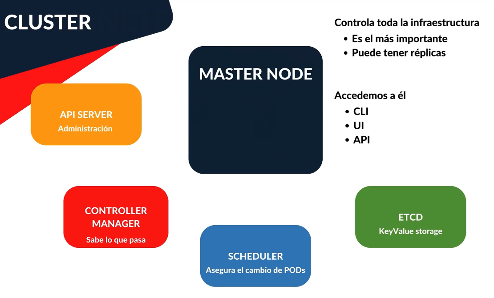
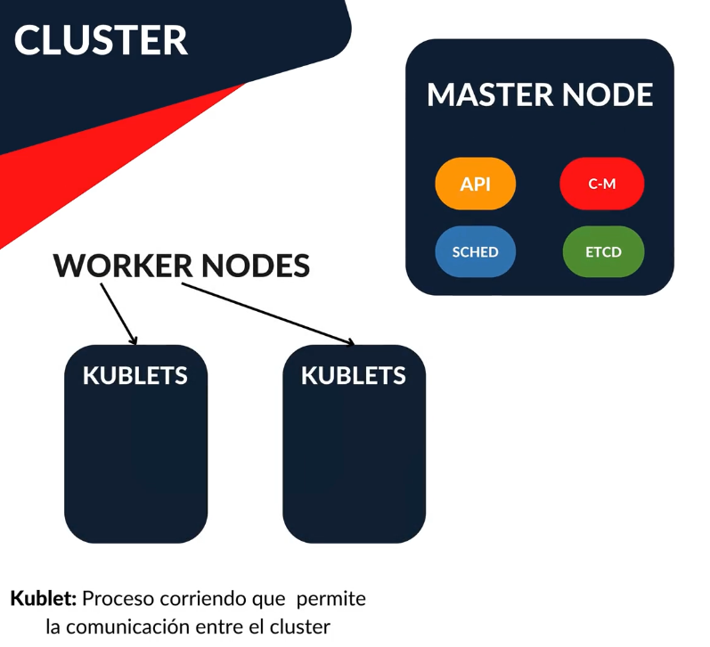
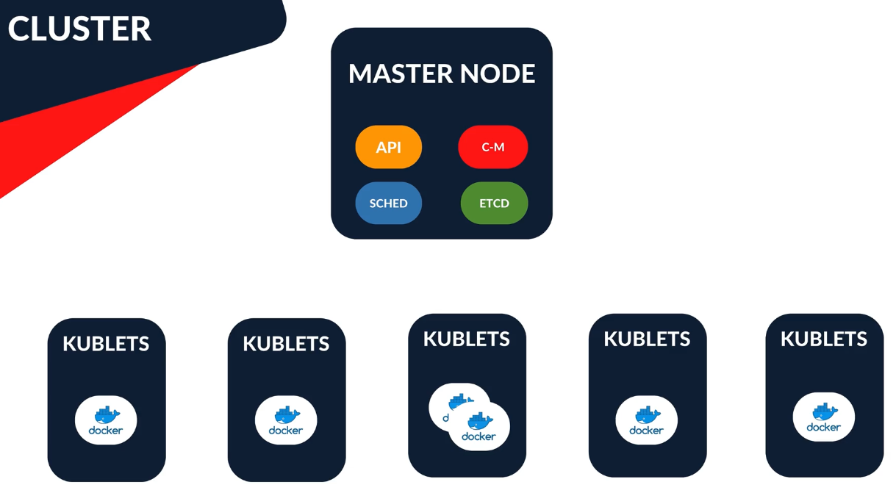
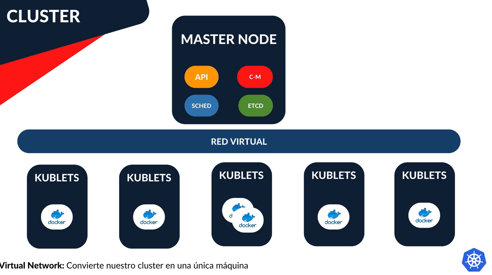
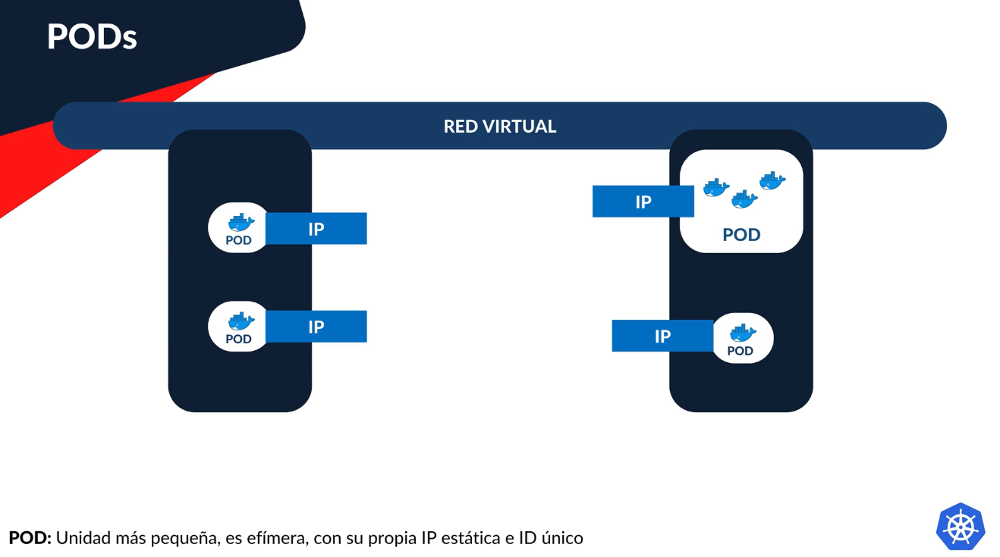
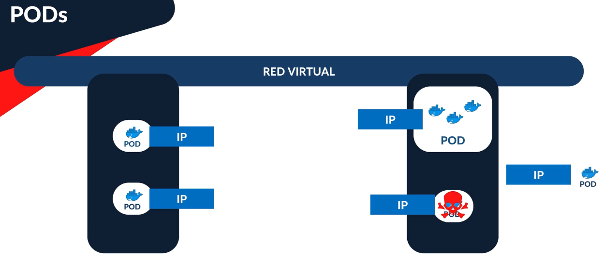
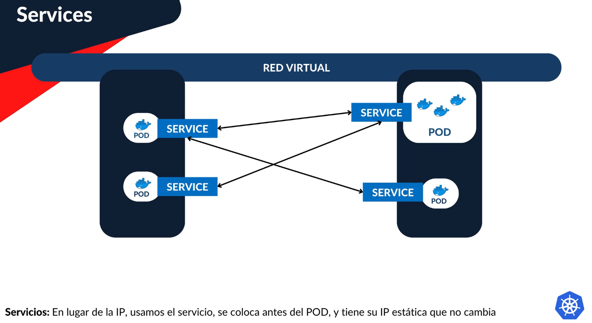
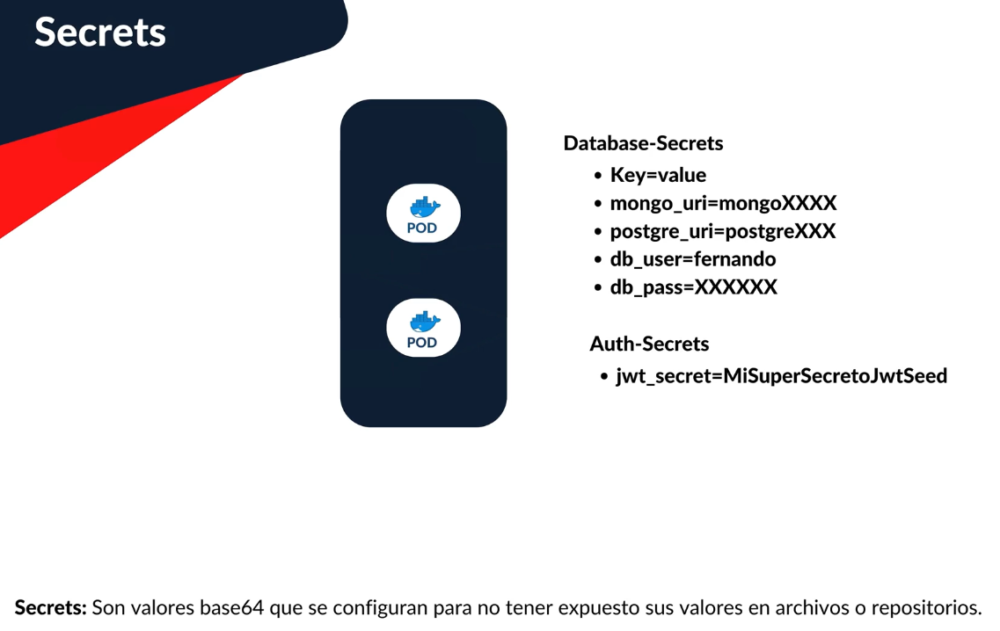

# Kubernetes

Esta es una sección interesante en la cual vamos a configurar nuestro cluster de Kubernetes localmente, lo cual nos permitirá aprender mucho sobre:

- Cluster
- Virtual Network
- Pods
- Master Node
- Worker Nodes
- Secrets
- Deployments
- Configuraciones
- Logs
- Autenticación

La idea es tener nuestra introducción a Kubernetes para después proceder a publicar y desplegarlo, todo lo que veremos aquí es agnóstico a la plataforma que usarán para desplegar su cluster.

## Introducción a K8s

Kubernetes permite a los desarrolladores desplegar, actualizar y administrar aplicaciones de manera eficiente, proporcionando herramientas para la gestión de recursos, el balanceo de carga (múltiples instancias o réplicas de la misma aplicación), la auto curación y la escalabilidad horizontal.

El cluster de Kubernetes consta de varias piezas, de la cual la más importante es el Master Node. Puede haber más de uno porque puede tener réplicas. Si se cae, perdemos acceso al cluster.

Los Worker Nodes es donde se realiza el proceso de nuestra aplicación. Están directamente relacionados a un proceso llamado Kublet, que es el proceso que permite la comunicación entre nuestro cluster.

Podemos tener múltiples Kublets e internamente vamos a tener nuestros Pods.

Y todo está interconectado por una red virtual, hermética y sellada al mundo exterior, que es básicamente lo que hemos estado utilizando cuando hacíamos el docker-compose, teníamos nuestra imagen de NATS y teníamos una comunicación mediante los name servers o DNS, que cada uno de esos contenedores tenía su nombre. Todo esto lo permite esta red virtual de Kubernetes.

Sobre los Pods, indicar que es la unidad más pequeña, es efímera y tiene su propia dirección IP. Es donde realmente se va a realizar el trabajo. Podemos tener réplicas dentro del pod, podemos tener un único contenedor o más de uno, y la demanda podemos verla y escalarla para tener más o menos réplicas.

Si el pod falla o se cae, Kubernetes crea una nueva versión del pod y va a reemplazar la anterior, y esto genera una nueva dirección IP. Por eso se dice que son efímeros. No se guarda información en esos pods, porque, como hemos visto, ante una falla, esa data se pierde.

Para establecer la comunicación, en lugar de usar las direcciones IP, se usan services. Los pods se conectan a esos servicios. Los services tienen una dirección IP estática. Esto es lo que permite al cluster de Kubernetes poder mantener la comunicación cuando los pods se destruyen y se generan con una nueva dirección IP.

Aunque hay muchos más conceptos, el último que vamos a ver por ahora son los Secrets. No queremos poner nuestras llaves secretas ni cadenas de conexión expuestas en el código fuente, porque vamos a trabajar mucho con archivos .yml y necesitmos hacerles seguimiento en un repositorio. Esta información sensible es la que se guarda en los Secrets, que son pares de valores key-value.

Con lo que hemos visto, nos falta algo para comunicarnos con el mundo exterior, como BBDD externas por ejemplo, ya que la red virtual está sellada. Esto lo hacemos con otro concepto llamado Ingress, pero esto lo veremos más adelante.

## K8s y Helm - Instalaciones

Tenemos que hacer dos configuraciones en nuestro equipo para poder trabajar con Kubernetes.

Helm es un package manager para Kubernetes: `https://helm.sh/`. Lo vamos a usar para crear el proyecto y para hacer actualizaciones. Yo lo instalo en Mac usando el comando `brew install helm` y en la Raspberry Pi usando `https://snapcraft.io/install/helm/raspbian`.

También deberíamos tener instalado `kubectl` por el hecho de tener instalado Docker Desktop. Si no aparece, se puede seguir esta ayuda: `https://kubernetes.io/docs/tasks/tools/install-kubectl-linux/`.

Ver también: `https://minikube.sigs.k8s.io/docs/`.
